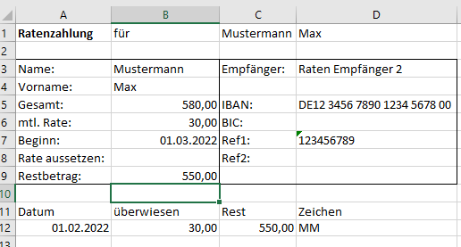
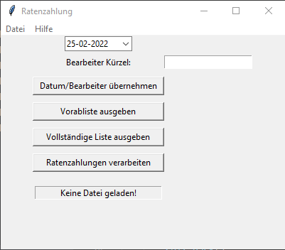

# Ratenzahlung

Das Program Ratenzahlung unterstützt die Verwaltung von Ratenzahlungen, die in einer Excel-Datei gespeichert sind. Es ist in Python 3 geschrieben.

## 1. Excel-Datei

Jede einzelne Ratenzahlung wird in Excel in einem Tabellenblatt gespeichert und kann so auch als Kontoauszug gedruckt oder als PDF weitergegeben werden.
In neueren Versionen von Excel ist die Anzahl der Blätter in einer Excel-Arbeitsmappe nur durch den Arbeitsspeicher begrenzt. Tests mit 90 Ratenzahlungen/Tabellenblätter konnten mit Excel 2013 und Excel 2019 problemlos bearbeitet werden.

Die Daten zu den jeweiligen Ratenzahlungen werden in der Excel-Datei erfasst, wie in der Datei "Ratenzahlung-Muster.xlsx". Es muss eine Gesamtschuld, mtl. Rate sowie ein Restbetrag eingegeben werden. Der Restbetrag ist zu Ratenbeginn mit der Gesamtschuld identisch.
Mit jeder Verarbeitung werden Überweisungsdatum, Überweisungs-Rate, Restbetrag und Bearbeiter an das jeweilige Excel-Blatt angehängt und der Restbetrag durch das Python Programm angepasst.

Soll eine Rate ausgesetzt werden, dann wir ein kleines *j* in das Feld **Rate aussetzen** eingefügt. Diese Ratenzahlung wird so lange nicht verarbeitet, bis das *j* wieder entfernt wird.

Werden nur einmal am Anfang des Monats die Ratenzahlungen überwiesen, dann gibt man bei neuen Zahlungen den 1. des Monats als Ratenbeginn ein.

## 2. Python Programm "Ratenzahlung"

Nach dem Start der Programms lädt man die Ratenzahlung-Datei über den Menüpunkt **Öffnen**. Dann legt man das Datum über den Kalender fest (z.B. 01-01-2022) und gibt einen Namen oder Kürzel ein. Nach der Verarbeitung sieht man in der Excel-Datei wer die jeweiligen Ratenzahlungen verarbeitet hat.
Nach dem klicken auf **Datum/Bearbeiter übernehmen** sind diese Informationen für den aktuellen Programmlauf festgelegt, können aber jederzeit durch Neueingabe und klicken auf übernehmen, geändert werden.

Über den Knopf **Vorabliste ausgeben** wird eine Liste im Excel-Format erzeugt. Es werden alle Ratenzahlungen, die zum festgelegten Datum beginnen oder bereits laufen, ausgegeben. Diese Liste kann beliebig oft erzeugt und mit Excel geöffnet/bearbeitet werden. Man kann sie zum Abgleich der Zahlungen und als Buchungsliste verwenden.

Mit **Liste aller Ratenzahlungen ausgeben** erhält man eine Excel-Datei mit allen in der Kartei erfassten Ratenzahlungen, unabhängig vom Ratenbeginn oder ob sie momentan ausgesetzt sind.

Sind die Ratenzahlungen in Ordnung und sollen in der Ratenzahlungs-Kartei eingetragen werden, dann geht das mit dem Knopf **Ratenzahlungen verarbeiten**. Damit werden die jeweiligen Restbeträge aktualisiert und die verarbeiteten Raten in der Liste unten angehängt. Die Excel-Datei wird mit dem Namen "Ratenzahlungen_neu_*Datum*" gespeichert.

Über **Datei -- Beenden** oder das **X** kann das Programm beendet werden.

## 3. Python Code

Der Python Code kann bei Bedarf angepasst werden. Die benötigten Python Pakete sind in der Datei **requirements.txt** gespeichert. Es empfielt sich ein "virtual Environment" anzulegen um die eigene Python Installation nicht unnötig mit weiteren Paketen "aufzublähen". Man kann dadurch auch sicherstellen, dass die Pakete mit einer bestimmten Python Version kompatibel sind.
Zum Ausführen benötigt man eine Python installation mit den wie oben beschriebenen Paketen. Möchte man das Python Programm als ausführbare Datei in Windows (EXE-Datei) haben, dann wird das Paket *Pyinstaller* benötigt. Es packt Python mit den benötigten Paketen in eine ausführbare Datei. Die Datei selbst kann einfach weitergegeben und ausgeführt werden. Eine Installation von Software ist nicht nötig. Eine Windows-EXE Datei zu packen geht es folgendem Befehl:

`pyinstaller.exe --hidden-import babel.numbers --onefile dateiname.py`
